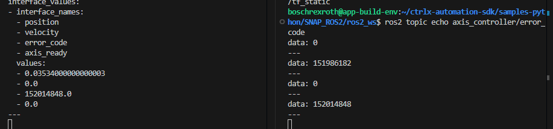

= Linrob Axis Control Package
Karim Zanaty <Karim.Zanaty@linrob.io>
v1.0.0, {docdate}
:toc:
:toclevels: 3
:icons: font
:sectnums:
:source-highlighter: pygments

== Overview

The `linrob_axis` package provides hardware interface drivers and controller plugins for controlling linear robotic axes using the ROS 2 control framework.

This package is part of the Linrob robot system and integrates with `ros2_control`, `controller_interface`, and other standard ROS 2 packages.

== Package Contents

This Debian package installs the following components:

- ROS 2 package: `linrob_axis`
- Plugins for `hardware_interface` and `controller_interface`
- Launch files and configuration templates

== Features

- Dedicated services for linear axis control
- Processing and execution of streamed positions as planned by MoveIt
- Read-out of current position, velocity, error code, and axis-ready-state

== System Requirements

- ROS 2 Humble
- Ubuntu 22.04 (Jammy)
- Real-time kernel (recommended)

== Installation

To install the package:

[source, bash]
----
sudo apt install ./ros-humble-linrob-axis_<latest.version>-0jammy_amd64.deb
----

Make sure all dependencies (e.g., `ros-humble-ros2-control`) are installed.
The package cltrx-datalayer-2.6.1.deb is required and will be provided on request. This must be installed beforehand.

== Usage

=== Starting the Hardware Interface

[source, bash]
----
ros2 launch linrob_axis start.launch.py
----

This will start the hardware interface node which connects to the linear axis.

When the hardware interface is set to _active_, the axis controller will change its operation mode to "AUTO_EXTERNAL" and is ready to receive positioning commands via the position controller. Deactivating the hardware interface will set the axis back to "MANUAL" mode. The handheld device can only be used when the hardware interface is inactive.

The position controller allows the execution of streamed target positions. The positions will be sent to the 
`_/position_controller/commands_`
 topic as a single float number for the joint `joint_1`. The axis controller will recognize the frequency of sent data and act accordingly. Based on these times, an interpolation is done in the backend to ensure smooth movements and fulfill the requirements of the PLC backend.

The axis controller enables certain ROS2 services to command the axis. These are:

- /axis_controller/reset_axis
- /axis_controller/stop_axis
- /axis_controller/reference_axis
- /axis_controller/move_to_position

==== Service Calls

- **ResetAxis** (`/reset_axis`) - Resets the axis and acknowledges errors. No input parameters required.
```sh
ros2 service call /axis_controller/reset_axis linrob_axis/srv/ResetAxis "{}"
```
- **ReferenceAxis** (`/reference_axis`) - Starts a referencing/homing process. No input parameters required.
```sh
ros2 service call /axis_controller/reference_axis linrob_axis/srv/ReferenceAxis "{}"
```
- **StopAxis** (`/stop_axis`) - Stops active movement immediately. No input parameters required.
```sh
ros2 service call /axis_controller/stop_axis linrob_axis/srv/StopAxis "{}"
```

- **StartMotion** (`/start_motion`) - Commands a target position with a specified velocity. The velocity is an optional value and will be set to 0.025 m/s if not specified.
```sh
ros2 service call /axis_controller/start_motion linrob_axis/srv/StartMotion "{start: true, target_position: 3.0, velocity: 0.25}"
```

The position is given in meters and must be within the configured limits of the axis. These are -0.005 m to 3.46 m as restricted by the available hardware. Target positions outside this range will lead to errors in the controller.

The velocity is given in meters per second. The soft limit is set to 0.4 m/s. However, the drive has proven be have a hardware limit of around 0.235 m/s and cannot exceed that. Therefore, the suggested maximum velocity is 0.2 m/s to ensure smooth operation.

The maximum acceleration and deceleration (in m/s²) are configured in the ctrlX CORE drive settings and cannot be changed via ROS 2 at the moment.
These values are set to a maximum of 0.25 m/s² by default. Different operations set different dynamic values inside the controller to ensure smooth(er) movements.

==== Resource activation and deactivation

By default, after startup and launching, the joint_state_broadcaster is **active** and both the position_controller and axis_controller are **inactive** until you activate them using ROS 2 controller commands.

===== Activation

To activate the position controller, run:
[source, bash]
----
ros2 control switch_controllers --activate position_controller
----

To activate the axis controller, run:
[source, bash]
----
ros2 control switch_controllers --activate axis_controller
----

To activate both controllers, run:
[source, bash]
----
ros2 control switch_controllers --activate position_controller axis_controller
----

To activate the hardware component, run:
[source, bash]
----
ros2 control set_hardware_component_state linrob_hw active
----

===== Deactivation

To deactivate the position controller, run:
[source, bash]
----
ros2 control switch_controllers --deactivate position_controller
----

To deactivate the axis controller, run:
[source, bash]
----
ros2 control switch_controllers --deactivate axis_controller
----

To deactivate both controllers, run:
[source, bash]
----
ros2 control switch_controllers --deactivate position_controller axis_controller
----

To deactivate the hardware component, run:
[source, bash]
----
ros2 control set_hardware_component_state linrob_hw inactive
----

===== Check Controller State

To verify the controller state:
[source, bash]
----
ros2 control list_controllers
----

=== Topics

The package provides the following usable topics:

* error_code (std_msgs/msg/UInt32): Publishes the current error code of the axis.

* dynamic_joint_states (control_msgs/msg/DynamicJointState): Publishes the current joint states of `joint_1` including position, velocity, error_code and axis_ready.

==== /error_code

The error code topic publishes the current error code of the axis on change. It is not printed continuously. A value of 0 indicates no errors, while any non-zero value indicates an error state.



==== /dynamic_joint_states

The dynamic_joint_states topic publishes the current joint states of the axis `joint_1` including position, velocity, error_code and axis_ready. The position is given in meters, velocity in meters per second, error_code as an unsigned integer, and axis_ready as a boolean indicating if the axis is ready for operation (equals state STANDSTILL).

=== Configuring the application

The application can be preconfigured by the robot_description.xacro.urdf which can be fount in the _description_ folder of the package.

The following parameters are allowed to be set by the customer

* *ip*: (default: "192.168.1.1") Must not be changed but can be changed to the IP address of the ctrlX CORE if the customer needs to change it.
* *user*: (default: "boschrexroth") Must not be changed but can be changed to own account username
* *password*: (default: "boschrexroth") Must not be changed but can be changed to own account password
* *port*: (default: 443) Should not be changed unless a different port is configured on the ctrlX CORE
* *execute_movements_on_next_index*: (default: 3) This is the forerun of positions before the axis should acutually execute the movement. When this value is too small, the axis might be faster than new target positions are coming in.
* *update_frequency_hz*: Should align with the frequency of the MoveIt planner.
* *duplicate_append_limit*: (default: 5) Number of duplicate target positions if no new target was received. Ensures that the axis will reach the target with out errors.
* *position_tolerance_mm*: (default: 0.001) Position tolerance in mm for the controller. The target is reached when the current position of the axis is within this tolerance.
* *log_level*: (default: "info") Log level for the node. Options are: debug, info, warn, error, fatal.

== Known Issues and Remarks

NOTE: Currently supports only one linear axis at a time. This will be extended in further developments.

NOTE: The communication with the linear axis is not in real-time. The communication protocols to the datalayer do not allow real-time communication. For most applications, this is not a problem, as the linear axis is controlled in position mode and the internal controller of the axis ensures smooth movements.


IMPORTANT: The execution of streamed positions does not work properly yet and is still in a testing phase. Only small position changes (around +/- 0.01mm) are possible without errors. Larger position changes will lead to errors in the drive. This is under investigation and will be fixed in future releases.

== Changelog

* 1.0.0 - Initial release of `linrob_axis` as a Debian package.

== Contact

For questions, bug reports, or contributions:

- Email: info@linrob.io or Karim.Zanaty@linrob.io

